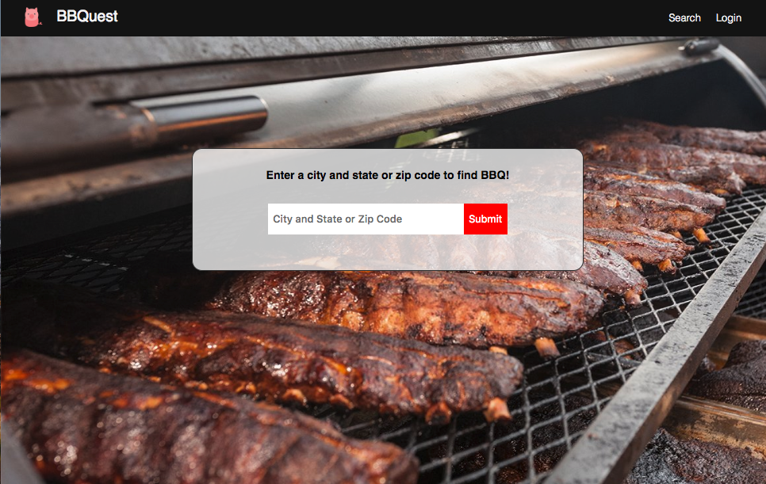

# BBQuest
A Turing- Module 3 personal project by
[Tory Dannenberg](https://github.com/tdberg21)

## Overview

BBQuest is an app that allows you to search for BBQ anywhere in the United States, and then read reviews and see ratings for those restaurants. It also allows you to track restaurants you've tried, what you ate and give them your own personal rating! 


Set Up Instructions 
```
npm install
npm start
```

[Backend Repo](https://github.com/tdberg21/barbecue-BE)


## Screenshots
Home Page


Login Page


Search Results


Restaurant Details


